# Task 6 Report: Hyperboloid Cooling Tower Optimization

Generated: 2026-02-25 19:19

## 1. Objective
Minimize cooling-tower lateral shell area using SA, PSO, and BFGS while enforcing fixed target volume and scenario-specific constructability constraints.
The study compares stochastic and deterministic optimization behavior across eight structurally different problem setups while keeping common engineering requirements (capacity and realistic shape) explicit in the objective.

## 2. Geometry Model
The tower is modeled as a stack of frustums.

- Frustum area: `A_i = pi * (r_{i-1} + r_i) * sqrt((r_i - r_{i-1})^2 + h_i^2)`
- Frustum volume: `V_i = (pi * h_i / 3) * (r_{i-1}^2 + r_{i-1}*r_i + r_i^2)`
- Tower totals: `A = sum(A_i)`, `V = sum(V_i)`

Lateral shell area is optimized (top and bottom caps excluded), which directly corresponds to shell-construction material for fixed end radii.
Analytic gradients were used for both `A` and `V`, and for all penalty terms, so BFGS receives exact first-order information.

### 2.1 Design Variables by Scenario Type
- `radii` mode: optimize interior radii `r1..r_{m-1}` while ring heights are fixed from `z` levels.
- `heights` mode: optimize segment heights `h1..hm` while all ring radii are fixed.
- `joint` mode: optimize both interior radii and all heights simultaneously.

## 3. Optimization Methods

### 3.1 Simulated Annealing (SA)
SA performs single-solution stochastic search. At each evaluation, a local perturbation is proposed and accepted if it improves objective, or probabilistically accepted otherwise using the temperature schedule.
This supports escape from local minima early in search and gradual exploitation as temperature cools.

### 3.2 Particle Swarm Optimization (PSO)
PSO evolves a population of particles with velocity updates using inertia, cognitive pull to personal best, and social pull to global best.
It is typically strong on global exploration and multimodal landscapes, but can require many evaluations to satisfy strict constraints.

### 3.3 BFGS (Deterministic Quasi-Newton)
BFGS updates an inverse-Hessian approximation and computes descent directions with line search, yielding rapid local convergence when gradients are informative.
It is efficient in evaluation count but can be sensitive to initialization and non-convex penalties.

## 4. Penalized Objective and Geometrical Constraints
The optimized scalar objective is `J(x) = A(x) + P_volume + P_height + P_shape + P_smooth + P_bounds + P_ratio` (terms enabled per scenario).

### 4.1 Constraint Terms and Their Function
- `P_volume`: enforces target cooling capacity by penalizing relative deviation from target volume.
- `P_height`: enforces total tower height in scenarios where heights vary, preserving comparable overall structure.
- `P_shape`: enforces hyperboloid-like monotonic contraction to neck and expansion above neck.
- `P_smooth`: penalizes second differences in radii to avoid oscillatory/sawtooth shell profiles.
- `P_bounds`: hinge penalty for design-variable bounds to keep variables in practical/constructable ranges.
- `P_ratio` (S8): limits adjacent-height ratios to promote constructability and avoid abrupt segment transitions.

### 4.2 Feasibility Rule
- Relative volume error must be `<= 1e-3`.
- If heights vary, relative total-height error must be `<= 1e-3`.
- If radii vary, monotonic hyperboloid violation must be `<= 1e-6`.

## 5. Optimization Protocol
- Runs per algorithm per scenario: 10
- Seed offset: 0
- SA: `temp_init=120`, `cooling_rate=0.997`, scenario-dependent `step_size`
- PSO: `w=0.65`, `c1=1.6`, `c2=1.7`, particles = 40 or 50 by dimension
- BFGS: `tol=1e-7`, `max_iter=1200`
- Penalties: volume, height sum (when applicable), shape monotonicity, smoothness, bounds, ratio (S8)

Stochastic budgets are 10k evaluations for lower-dimensional setups and 16k for joint/high-dimensional setups. BFGS uses smaller budgets due to faster local convergence.

## 6. Scenario Definitions
| ID | Mode | m | Target Volume | r0 | rm | Description |
|---|---|---|---|---|---|---|
| S1 | radii | 10 | 70320 | 39.3 | 27.4 | Required case with bounded radii and required ring heights. |
| S2 | radii | 10 | 70320 | 39.3 | 27.4 | Required case with wide radii range (unconstrained-like). |
| S3 | radii | 10 | 70320 | 39.3 | 27.4 | Uniform-height radii design with bounded radii. |
| S4 | radii | 12 | 70320 | 39.3 | 27.4 | Finer discretization (m=12) with bounded radii and smoothness. |
| S5 | heights | 10 | 70320 | 39.3 | 27.4 | Fixed radii, optimize bounded heights. |
| S6 | heights | 10 | 70320 | 39.3 | 27.4 | Fixed radii, optimize wide-range heights (unconstrained-like). |
| S7 | joint | 10 | 70320 | 39.3 | 27.4 | Joint bounded optimization of radii and heights. |
| S8 | joint | 10 | 90000 | 39.3 | 27.4 | Joint constructability-aware design with larger target volume. |

## 7. Cross-Algorithm Summary
| Algorithm | Total Runs | Mean Area | Mean Rel Vol Err | Mean Evals | Mean Time (s) | Feasibility Rate |
|---|---|---|---|---|---|---|
| SA | 80 | 7814.56 | 5.277e-04 | 11500.0 | 0.5373 | 71.2% |
| PSO | 80 | 8264.80 | 1.698e-02 | 11500.0 | 0.5744 | 50.0% |
| BFGS | 80 | 7850.64 | 4.018e-04 | 4227.9 | 0.2097 | 72.5% |

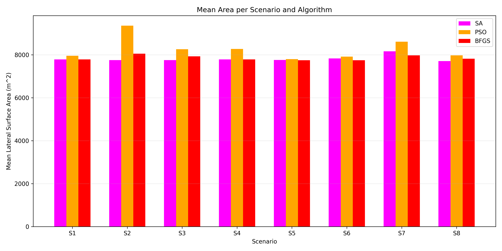

## 8. Scenario Results

### S1
| Algorithm | Mean Area | Std Area | Mean Rel Vol Err | Mean Evals | Mean Time (s) | Feasibility Rate |
|---|---|---|---|---|---|---|
| BFGS | 7782.01 | 0.00 | 1.537e-03 | 3302.6 | 0.1629 | 0.0% |
| PSO | 7950.10 | 201.50 | 1.571e-02 | 10000.0 | 0.5322 | 20.0% |
| SA | 7781.85 | 4.69 | 1.246e-03 | 10000.0 | 0.5033 | 50.0% |

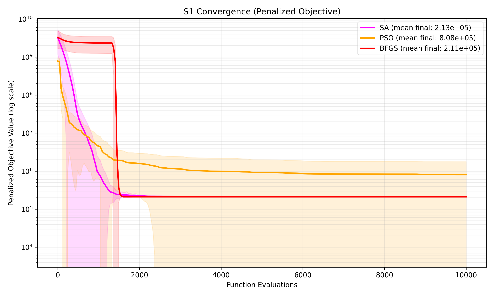

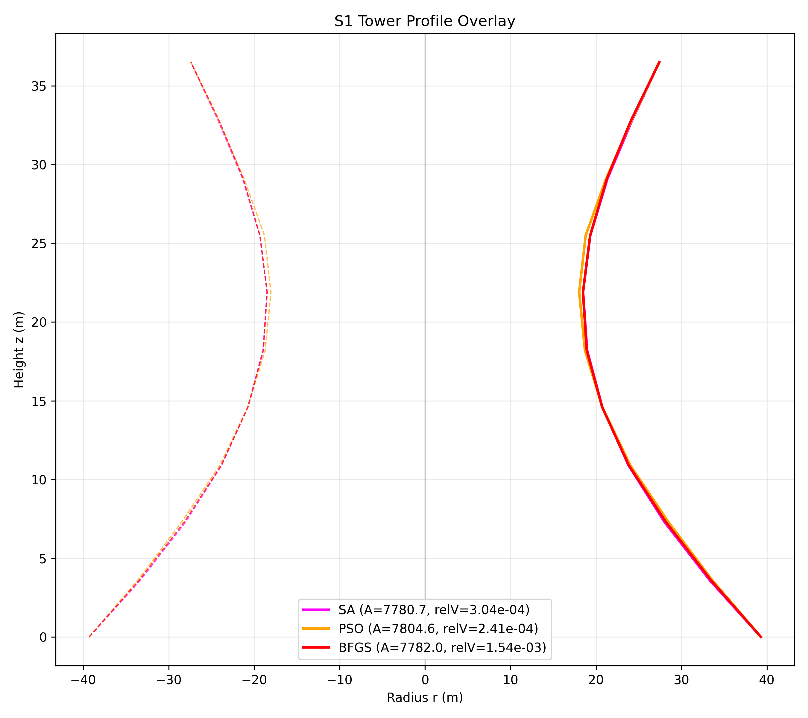

Feasibility of the shown 3D towers (same selected runs as profile overlay):
- SA: **FEASIBLE** - passes volume (3.037e-04 <= 1.000e-03), shape (0.000e+00 <= 1.000e-06).
- PSO: **FEASIBLE** - passes volume (2.407e-04 <= 1.000e-03), shape (0.000e+00 <= 1.000e-06).
- BFGS: **INFEASIBLE** - fails volume (1.537e-03 > 1.000e-03). visualized run is lowest penalized objective among infeasible runs.

### S2
| Algorithm | Mean Area | Std Area | Mean Rel Vol Err | Mean Evals | Mean Time (s) | Feasibility Rate |
|---|---|---|---|---|---|---|
| BFGS | 8051.30 | 532.40 | 1.485e-04 | 3945.5 | 0.1556 | 100.0% |
| PSO | 9352.84 | 524.78 | 6.536e-02 | 10000.0 | 0.4390 | 40.0% |
| SA | 7753.26 | 9.27 | 5.492e-05 | 10000.0 | 0.4092 | 100.0% |

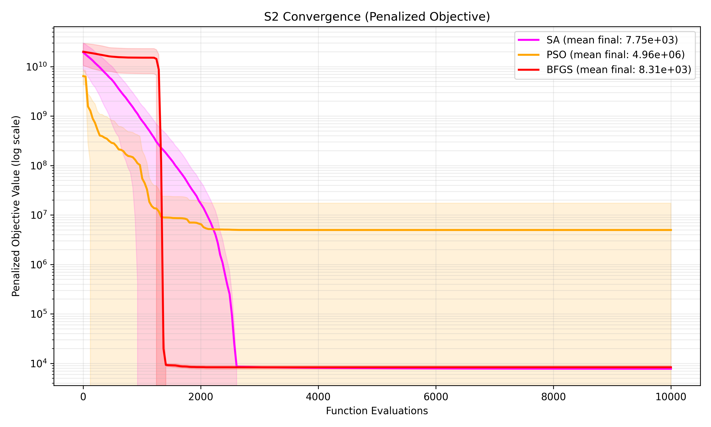

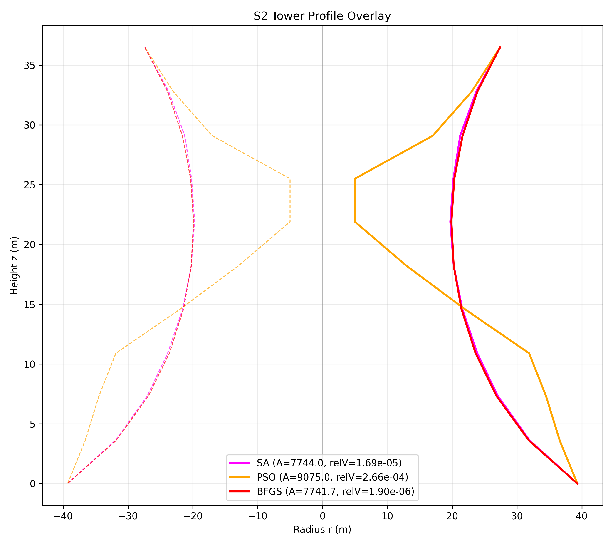

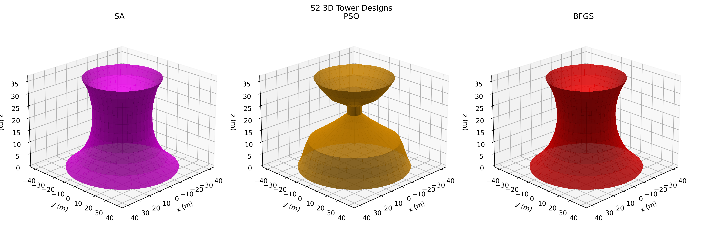

Feasibility of the shown 3D towers (same selected runs as profile overlay):
- SA: **FEASIBLE** - passes volume (1.686e-05 <= 1.000e-03), shape (0.000e+00 <= 1.000e-06).
- PSO: **FEASIBLE** - passes volume (2.663e-04 <= 1.000e-03), shape (0.000e+00 <= 1.000e-06).
- BFGS: **FEASIBLE** - passes volume (1.899e-06 <= 1.000e-03), shape (0.000e+00 <= 1.000e-06).

### S3
| Algorithm | Mean Area | Std Area | Mean Rel Vol Err | Mean Evals | Mean Time (s) | Feasibility Rate |
|---|---|---|---|---|---|---|
| BFGS | 7926.31 | 300.48 | 1.541e-04 | 2904.7 | 0.1227 | 100.0% |
| PSO | 8258.12 | 351.80 | 2.509e-05 | 10000.0 | 0.4378 | 90.0% |
| SA | 7753.02 | 21.36 | 3.424e-05 | 10000.0 | 0.4124 | 100.0% |

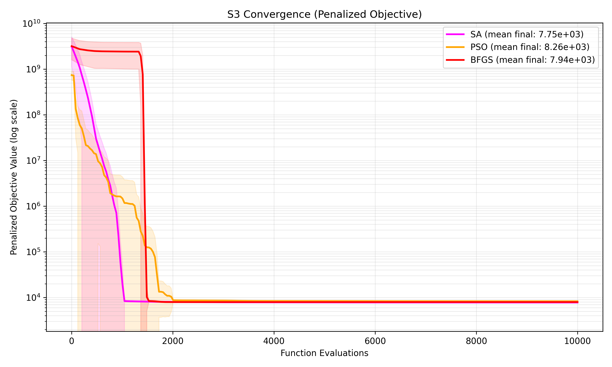

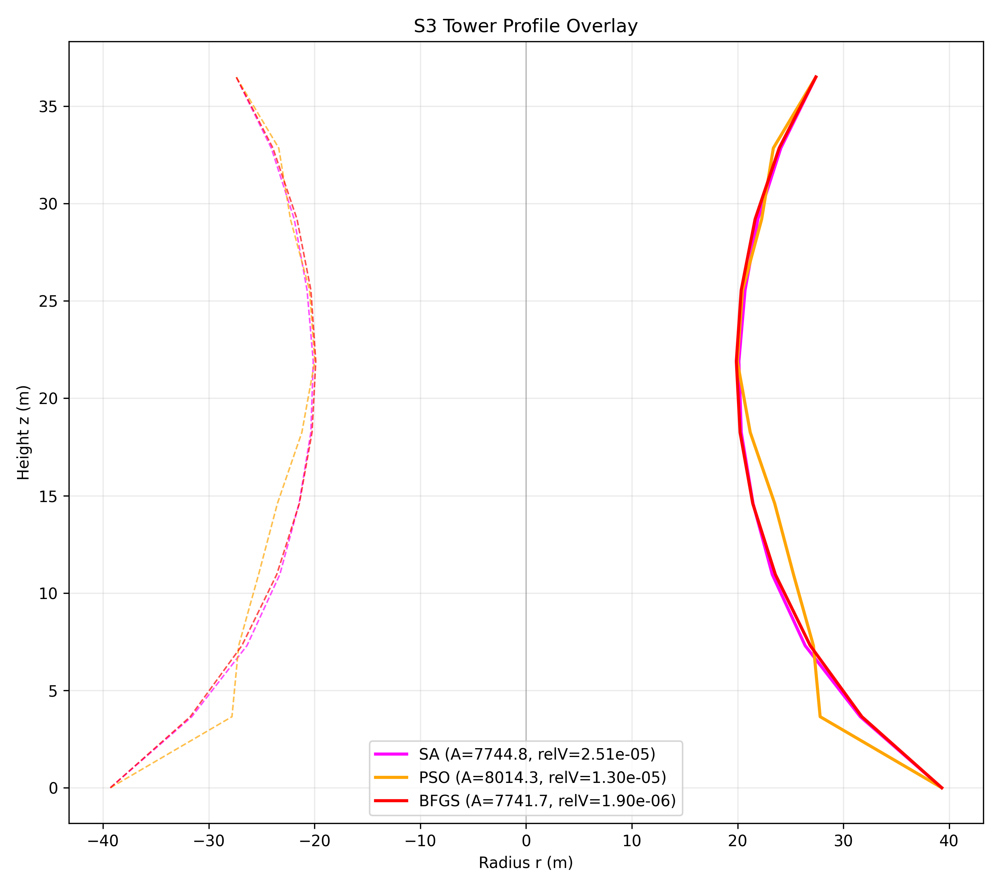

Feasibility of the shown 3D towers (same selected runs as profile overlay):
- SA: **FEASIBLE** - passes volume (5.257e-06 <= 1.000e-03), shape (0.000e+00 <= 1.000e-06).
- PSO: **FEASIBLE** - passes volume (1.211e-06 <= 1.000e-03), shape (0.000e+00 <= 1.000e-06).
- BFGS: **FEASIBLE** - passes volume (1.900e-06 <= 1.000e-03), shape (0.000e+00 <= 1.000e-06).

### S4
| Algorithm | Mean Area | Std Area | Mean Rel Vol Err | Mean Evals | Mean Time (s) | Feasibility Rate |
|---|---|---|---|---|---|---|
| BFGS | 7779.85 | 0.00 | 8.915e-04 | 4101.4 | 0.2508 | 100.0% |
| PSO | 8269.55 | 447.60 | 3.272e-02 | 10000.0 | 0.5619 | 0.0% |
| SA | 7783.18 | 14.88 | 1.557e-03 | 10000.0 | 0.5240 | 20.0% |

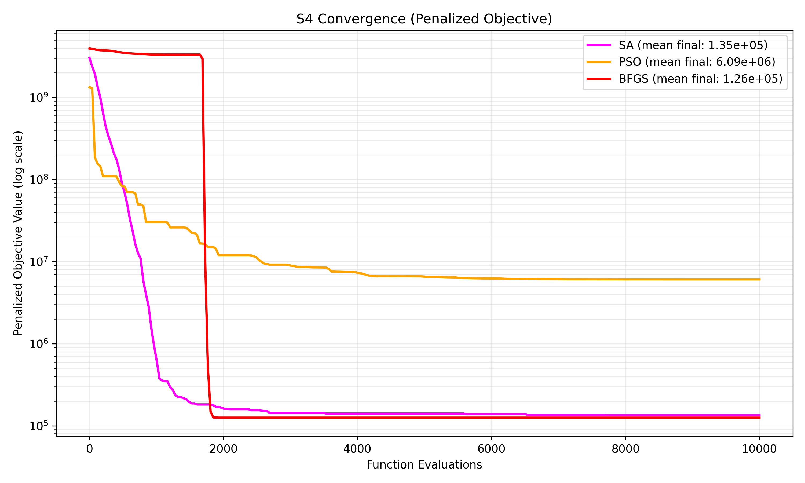

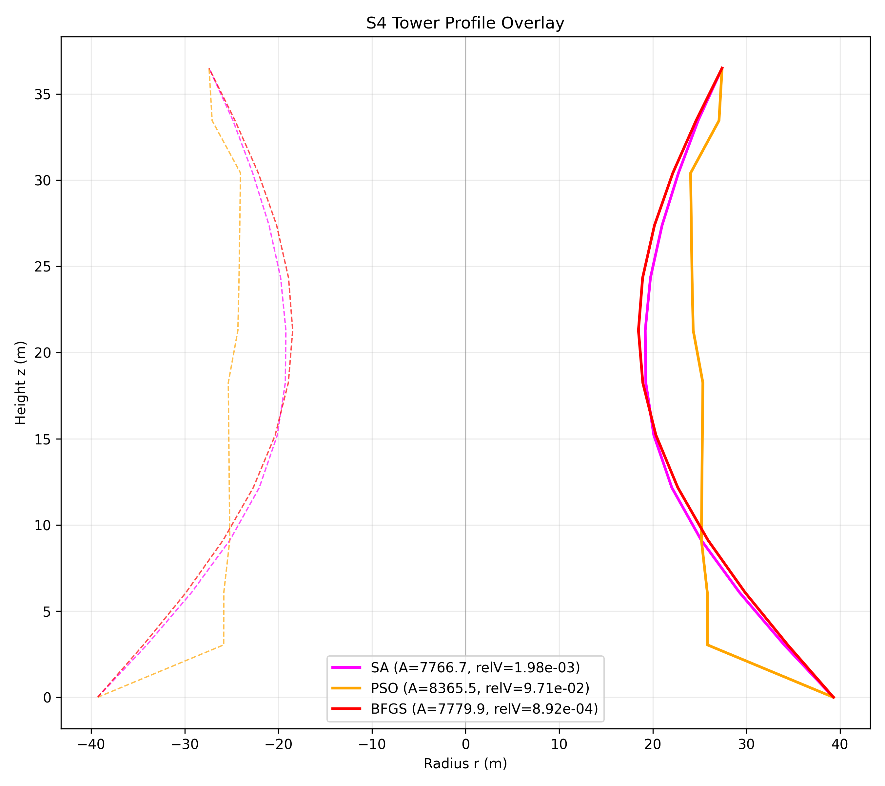

Feasibility of the shown 3D towers (same selected runs as profile overlay):
- SA: **FEASIBLE** - passes volume (3.986e-05 <= 1.000e-03), shape (0.000e+00 <= 1.000e-06).
- PSO: **INFEASIBLE** - fails volume (2.086e-03 > 1.000e-03). visualized run is lowest penalized objective among infeasible runs.
- BFGS: **FEASIBLE** - passes volume (8.915e-04 <= 1.000e-03), shape (0.000e+00 <= 1.000e-06).

### S5
| Algorithm | Mean Area | Std Area | Mean Rel Vol Err | Mean Evals | Mean Time (s) | Feasibility Rate |
|---|---|---|---|---|---|---|
| BFGS | 7742.56 | 0.00 | 2.331e-06 | 4164.2 | 0.1625 | 100.0% |
| PSO | 7796.77 | 32.30 | 1.128e-04 | 10000.0 | 0.4147 | 90.0% |
| SA | 7757.25 | 6.61 | 3.902e-05 | 10000.0 | 0.3880 | 100.0% |

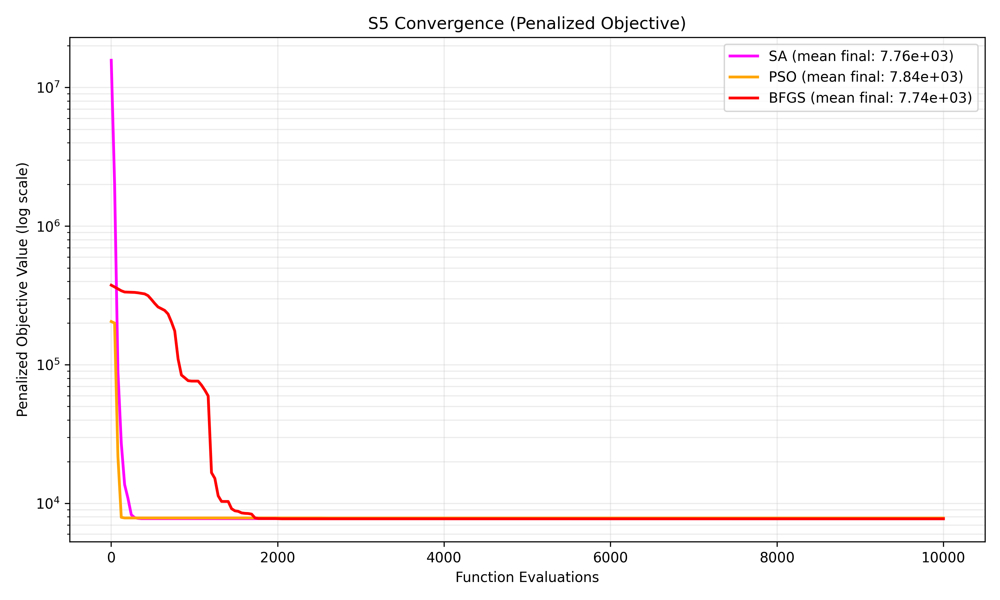

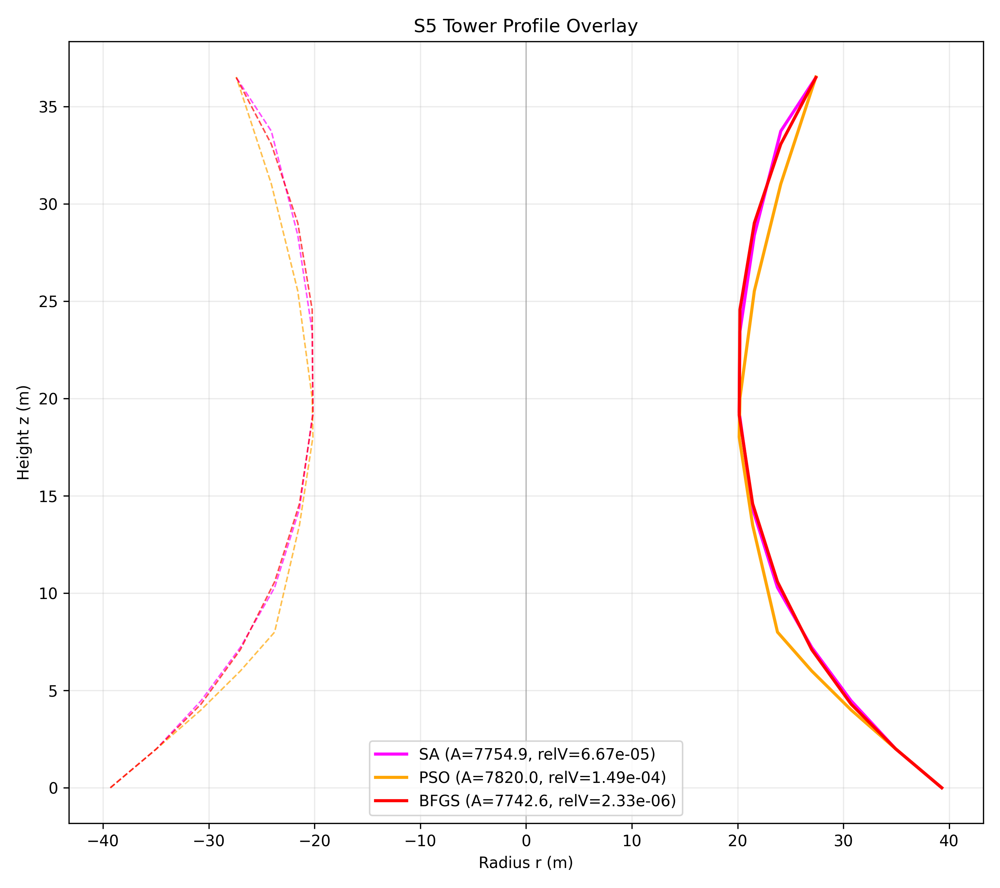

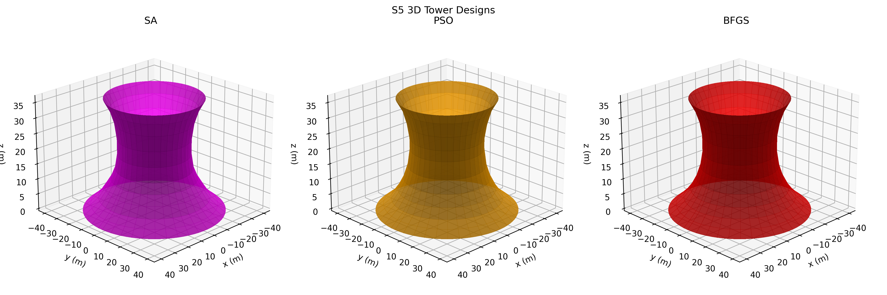

Feasibility of the shown 3D towers (same selected runs as profile overlay):
- SA: **FEASIBLE** - passes volume (7.754e-06 <= 1.000e-03), height (1.602e-04 <= 1.000e-03).
- PSO: **FEASIBLE** - passes volume (4.870e-07 <= 1.000e-03), height (6.591e-05 <= 1.000e-03).
- BFGS: **FEASIBLE** - passes volume (2.331e-06 <= 1.000e-03), height (8.747e-05 <= 1.000e-03).

### S6
| Algorithm | Mean Area | Std Area | Mean Rel Vol Err | Mean Evals | Mean Time (s) | Feasibility Rate |
|---|---|---|---|---|---|---|
| BFGS | 7741.72 | 0.00 | 2.071e-06 | 1402.6 | 0.0551 | 100.0% |
| PSO | 7913.68 | 146.68 | 5.923e-04 | 10000.0 | 0.4184 | 90.0% |
| SA | 7825.77 | 33.17 | 6.569e-05 | 10000.0 | 0.3880 | 100.0% |

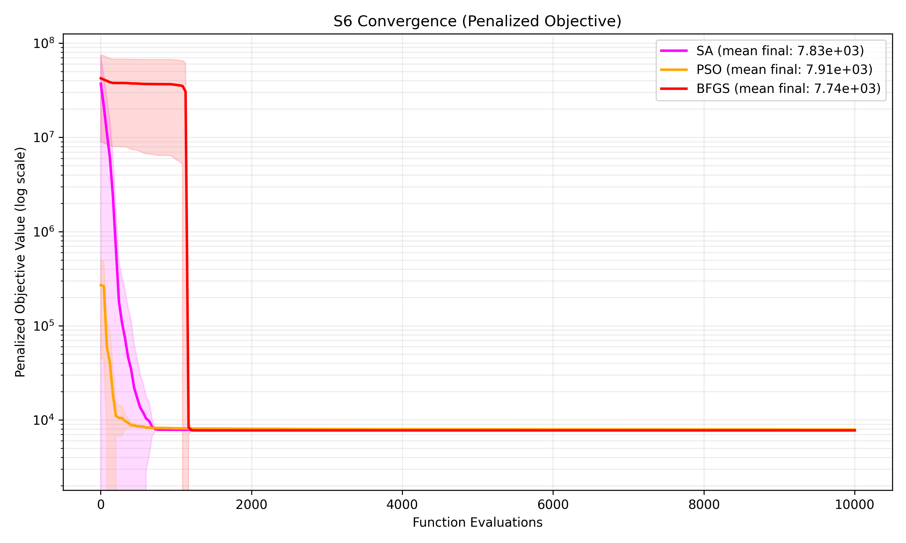

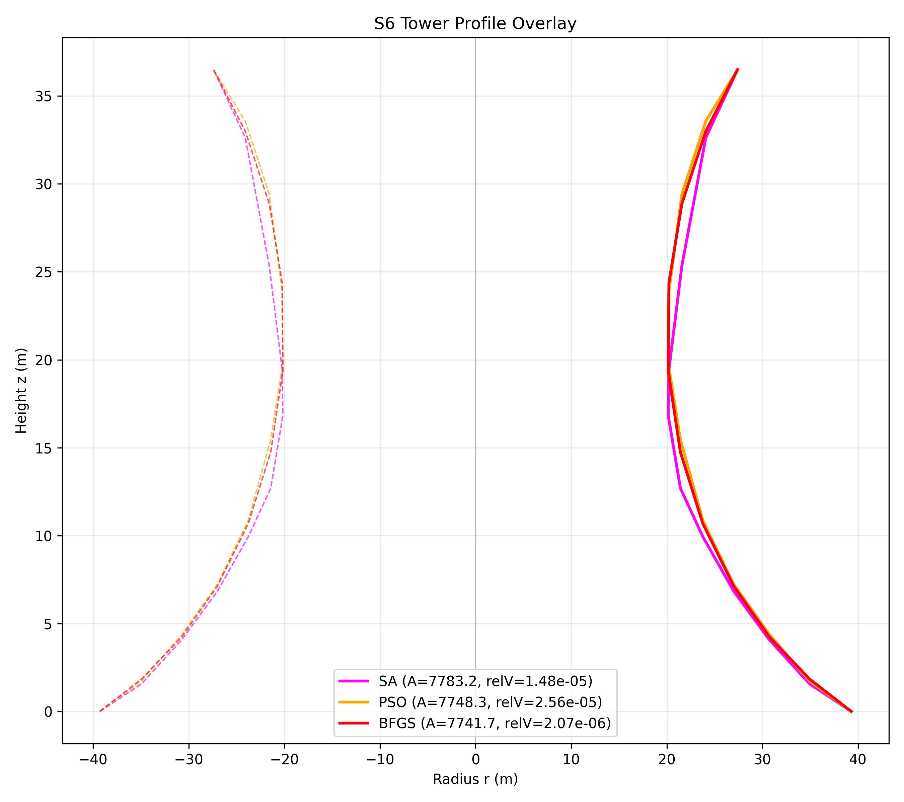

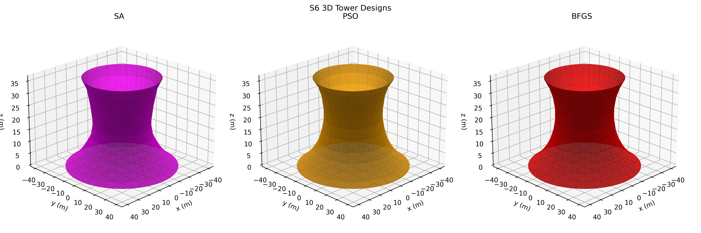

Feasibility of the shown 3D towers (same selected runs as profile overlay):
- SA: **FEASIBLE** - passes volume (1.478e-05 <= 1.000e-03), height (8.960e-05 <= 1.000e-03).
- PSO: **FEASIBLE** - passes volume (2.557e-05 <= 1.000e-03), height (5.838e-05 <= 1.000e-03).
- BFGS: **FEASIBLE** - passes volume (2.071e-06 <= 1.000e-03), height (8.632e-05 <= 1.000e-03).

### S7
| Algorithm | Mean Area | Std Area | Mean Rel Vol Err | Mean Evals | Mean Time (s) | Feasibility Rate |
|---|---|---|---|---|---|---|
| BFGS | 7968.31 | 369.60 | 6.476e-05 | 7000.9 | 0.3242 | 80.0% |
| PSO | 8608.62 | 174.56 | 4.144e-04 | 16000.0 | 0.7688 | 70.0% |
| SA | 8160.14 | 281.40 | 1.305e-04 | 16000.0 | 0.7203 | 100.0% |

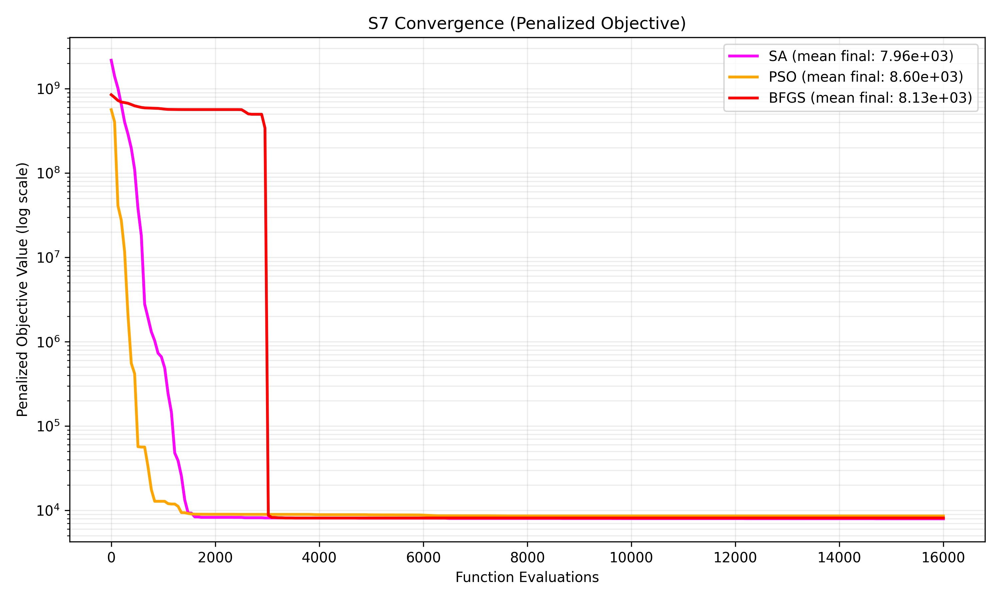

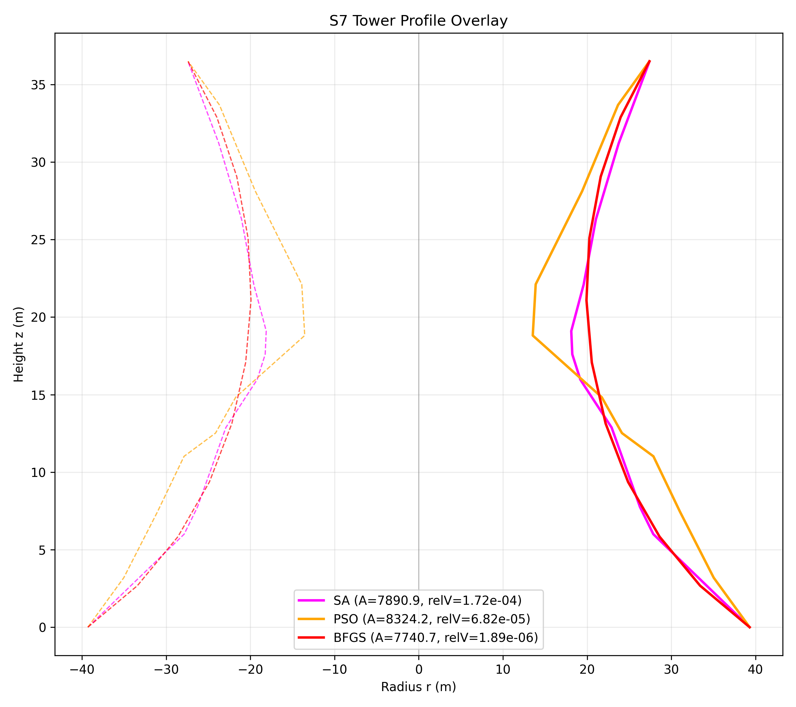

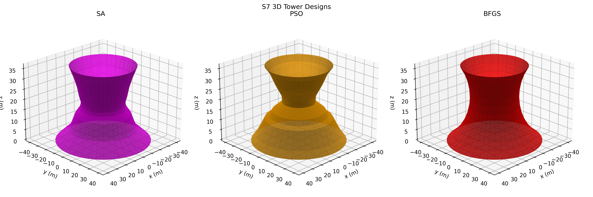

Feasibility of the shown 3D towers (same selected runs as profile overlay):
- SA: **FEASIBLE** - passes volume (1.717e-04 <= 1.000e-03), height (4.769e-04 <= 1.000e-03), shape (0.000e+00 <= 1.000e-06).
- PSO: **FEASIBLE** - passes volume (6.824e-05 <= 1.000e-03), height (9.218e-05 <= 1.000e-03), shape (0.000e+00 <= 1.000e-06).
- BFGS: **FEASIBLE** - passes volume (1.890e-06 <= 1.000e-03), height (8.481e-05 <= 1.000e-03), shape (0.000e+00 <= 1.000e-06).

### S8
| Algorithm | Mean Area | Std Area | Mean Rel Vol Err | Mean Evals | Mean Time (s) | Feasibility Rate |
|---|---|---|---|---|---|---|
| BFGS | 7813.08 | 0.46 | 4.146e-04 | 7001.0 | 0.4441 | 0.0% |
| PSO | 7968.67 | 348.77 | 2.087e-02 | 16000.0 | 1.0223 | 0.0% |
| SA | 7701.98 | 32.24 | 1.093e-03 | 16000.0 | 0.9536 | 0.0% |

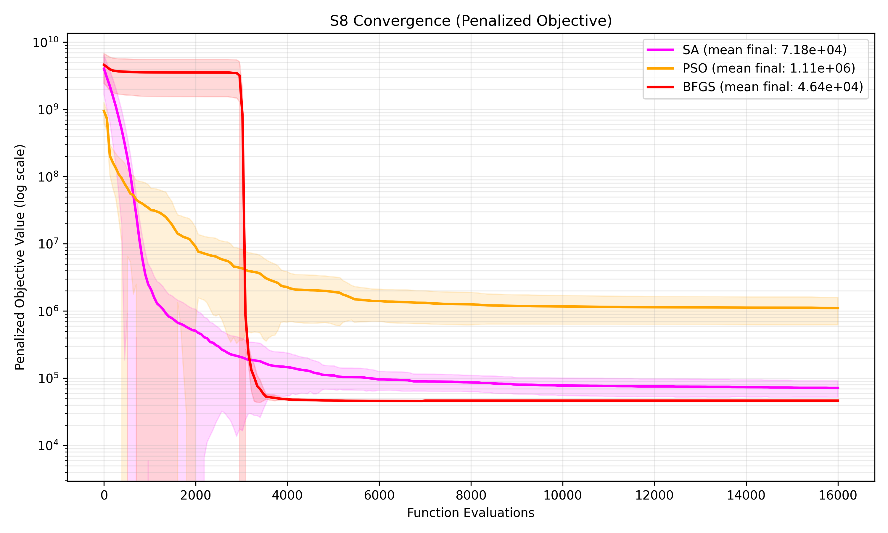

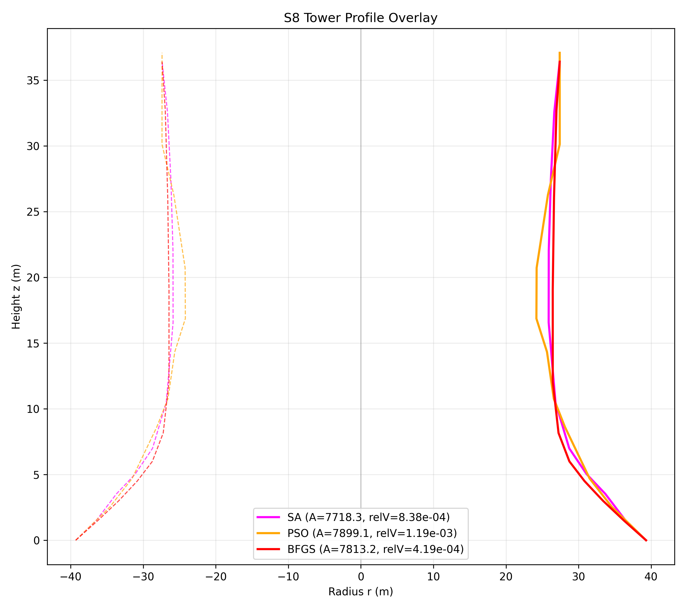

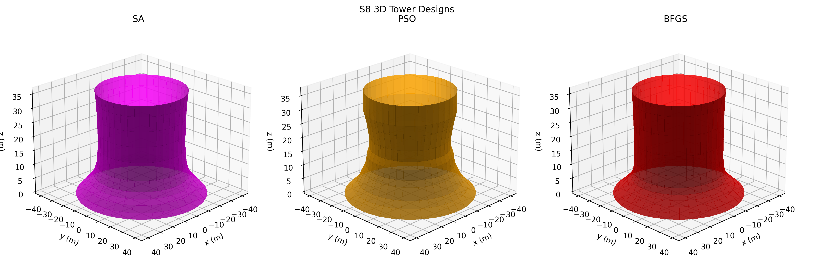

Feasibility of the shown 3D towers (same selected runs as profile overlay):
- SA: **INFEASIBLE** - fails height (2.220e-03 > 1.000e-03). visualized run is lowest penalized objective among infeasible runs.
- PSO: **INFEASIBLE** - fails volume (1.192e-03 > 1.000e-03), height (1.597e-02 > 1.000e-03), shape (6.460e-03 > 1.000e-06). visualized run is lowest penalized objective among infeasible runs.
- BFGS: **INFEASIBLE** - fails height (2.684e-03 > 1.000e-03), shape (2.649e-03 > 1.000e-06). visualized run is lowest penalized objective among infeasible runs.

## 9. Key Findings

- S1: best feasibility-area tradeoff = SA (feasibility 50.0%, mean area 7781.85 m^2).
- S1: lowest mean evaluation count = BFGS (3302.6 evals).
- S2: best feasibility-area tradeoff = SA (feasibility 100.0%, mean area 7753.26 m^2).
- S2: lowest mean evaluation count = BFGS (3945.5 evals).
- S3: best feasibility-area tradeoff = SA (feasibility 100.0%, mean area 7753.02 m^2).
- S3: lowest mean evaluation count = BFGS (2904.7 evals).
- S4: best feasibility-area tradeoff = BFGS (feasibility 100.0%, mean area 7779.85 m^2).
- S4: lowest mean evaluation count = BFGS (4101.4 evals).
- S5: best feasibility-area tradeoff = BFGS (feasibility 100.0%, mean area 7742.56 m^2).
- S5: lowest mean evaluation count = BFGS (4164.2 evals).
- S6: best feasibility-area tradeoff = BFGS (feasibility 100.0%, mean area 7741.72 m^2).
- S6: lowest mean evaluation count = BFGS (1402.6 evals).
- S7: best feasibility-area tradeoff = SA (feasibility 100.0%, mean area 8160.14 m^2).
- S7: lowest mean evaluation count = BFGS (7000.9 evals).
- S8: best feasibility-area tradeoff = SA (feasibility 0.0%, mean area 7701.98 m^2).
- S8: lowest mean evaluation count = BFGS (7001.0 evals).

- Feasibility bottleneck scenarios: S8 (all tested methods yielded 0% feasible runs under current constraints).

## 10. Discussion and Conclusions

Across all scenarios, **BFGS** achieved the highest overall feasibility (72.5%).
**BFGS** required the fewest evaluations on average (4227.9), confirming its efficiency for local convergence.
By raw mean area across all runs, **SA** produced the lowest average shell area (7814.56 m^2), but this must be interpreted jointly with feasibility rates.

Result patterns are consistent with expected method behavior: BFGS is computationally efficient and strong when gradients and local curvature align with feasible basins; SA is often robust under hard nonlinear penalties because probabilistic acceptance helps transition between constrained basins; PSO explores broadly but can underperform feasibility when penalty landscapes are steep and high-dimensional.

For practical engineering usage in this problem family, the recommended workflow is a hybrid strategy: use SA/PSO for global search and feasibility discovery, then warm-start BFGS for rapid refinement of the best feasible candidate.

Scenario S8 remains the principal bottleneck under the current penalty/budget setup; this indicates that constructability and enlarged-volume requirements are jointly tight. Future refinement should focus on adaptive penalty scheduling, better initialization heuristics for joint variables, and potentially increased stochastic budget for S8.

## 11. Deliverables
- `results/data/raw_runs.csv`
- `results/data/scenario_summary.csv`
- `results/data/algorithm_summary.csv`
- `results/data/scenario_definitions.json`
- `results/figures/*.png`