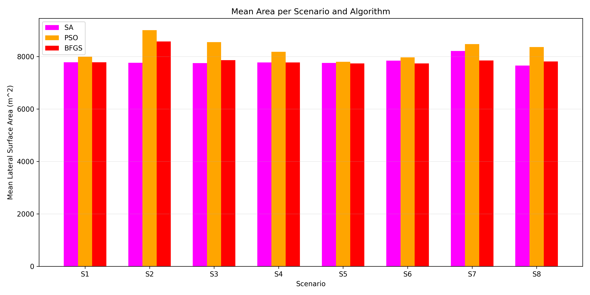
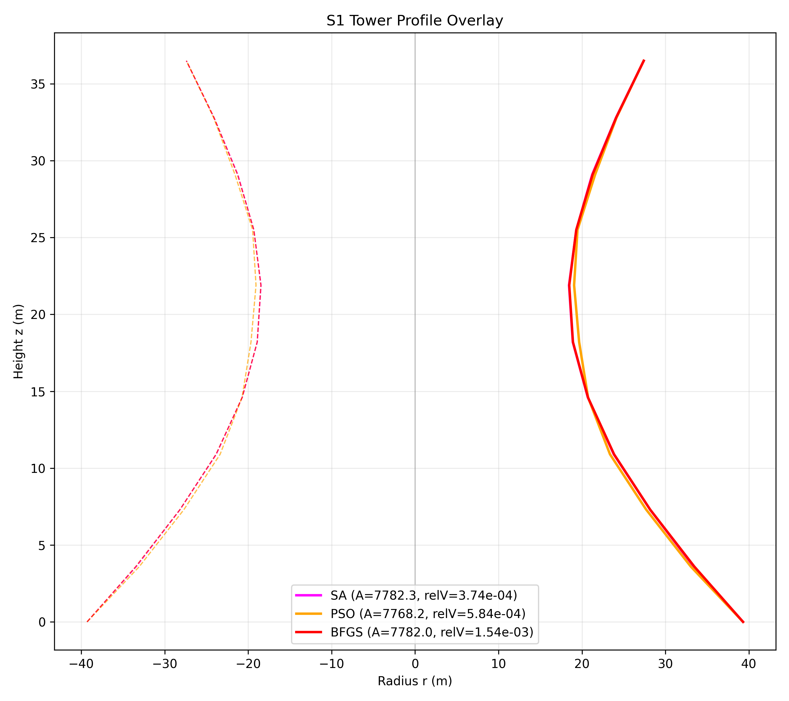
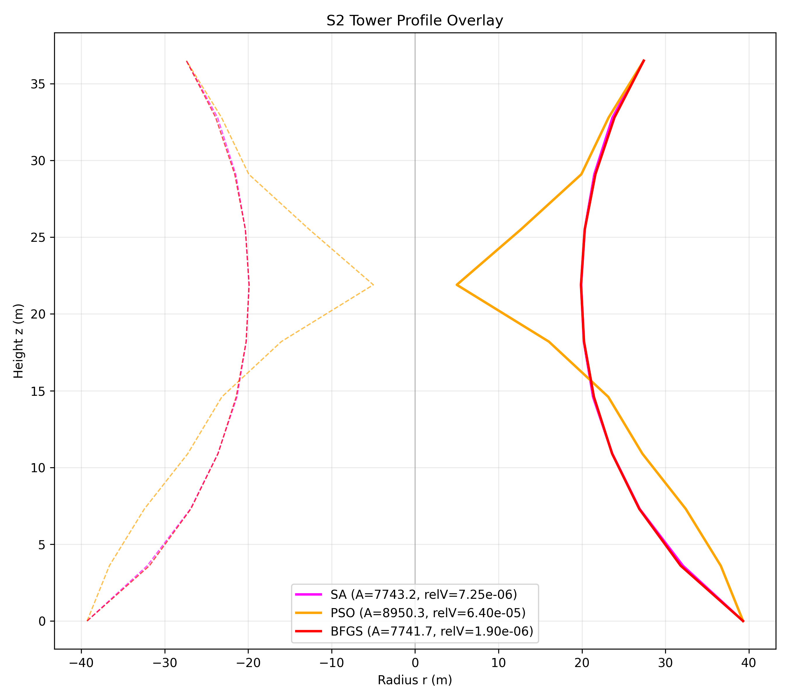
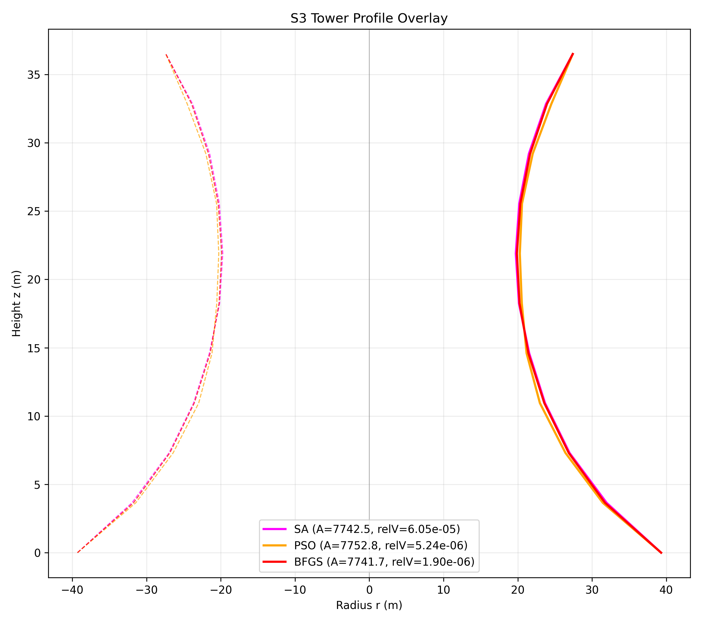
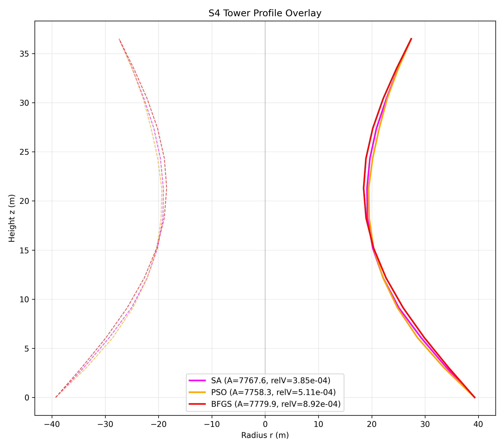
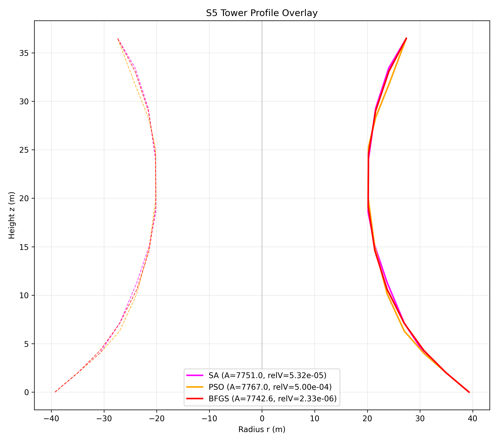
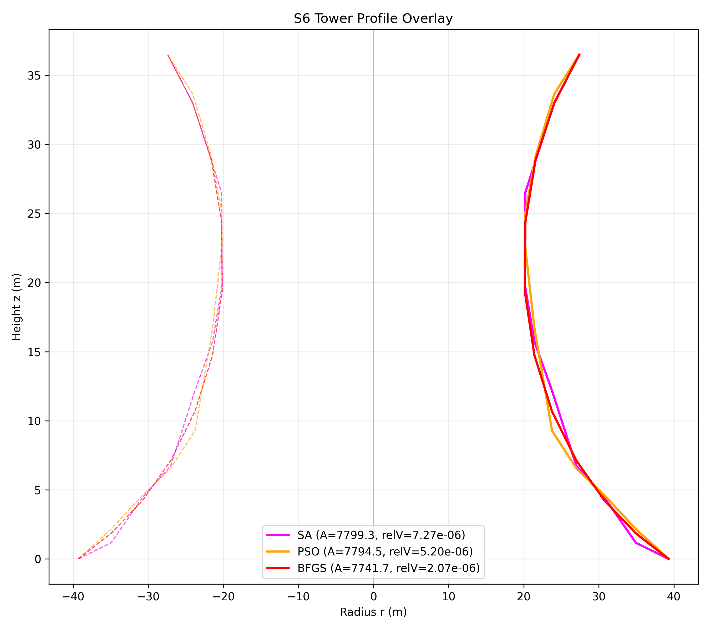
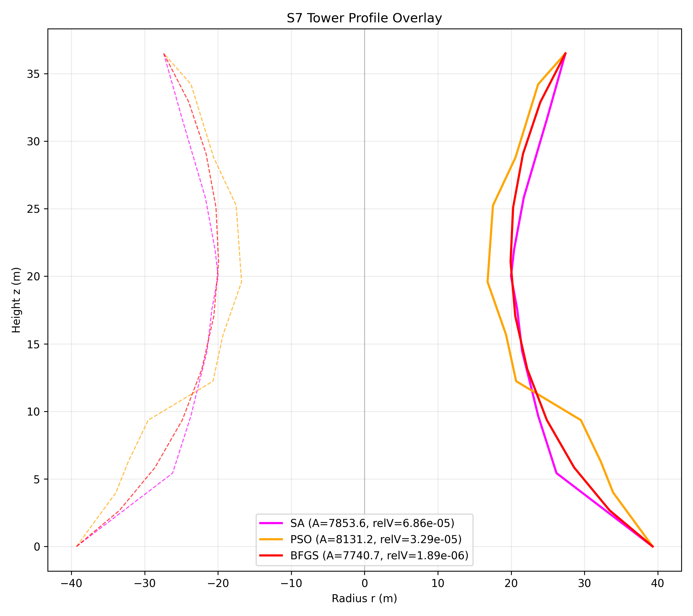
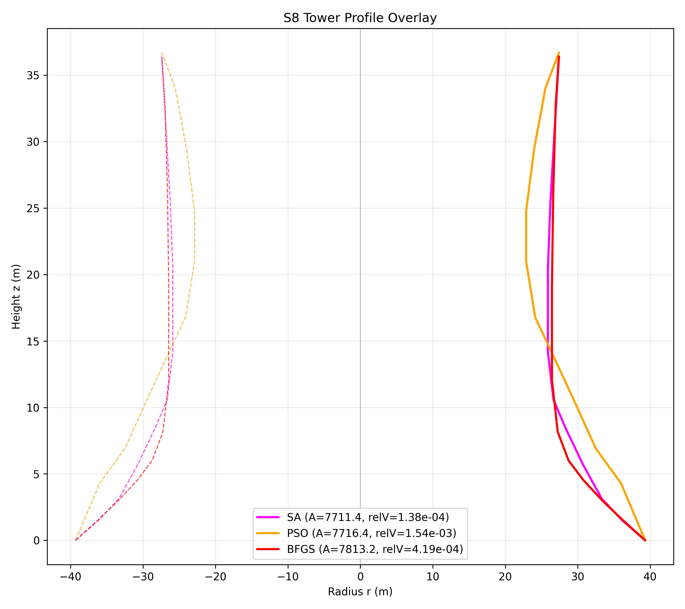

# Task 6 Fresh Reanalysis: Hyperboloid Cooling Tower Optimization

Generated: 2026-03-06 18:08

## 1. Purpose
This report is a fresh independent rerun of Task 6 using the same eight cooling-tower scenarios, the same three algorithms (SA, PSO, BFGS), the same budgets and penalties, and a new `seed_offset=50000`. The aim is to check which conclusions from the current Task 6 report are stable, which are sensitive to the stochastic rerun, and whether the work remains aligned with the assignment brief.

The assignment requirements for Task 6 are satisfied in this rerun: eight distinct scenarios are considered, radii-only, heights-only, and joint cases are all included, bounded and less constrained cases are both represented, `r0` and `rm` remain fixed, the target volume is enforced, hyperboloid-like shape constraints are used where needed, images of the towers are produced, and algorithm performance is compared using feasibility, function evaluations, and runtime.

## 2. Fresh Rerun Setup
The tower is modeled as a stack of frustums, with shell area minimized subject to fixed target volume and scenario-specific penalties. The three methods are Simulated Annealing (SA), Particle Swarm Optimization (PSO), and BFGS. Each algorithm was run 10 times per scenario. The rerun keeps the original Task 6 logic unchanged and only changes the seed offset so that the results are independent but directly comparable.

## 3. Cross-Algorithm Summary
| Algorithm | Mean Area | Mean Rel Vol Err | Mean Evals | Mean Time (s) | Feasibility Rate |
|---|---|---|---|---|---|
| SA | 7819.80 | 4.623e-04 | 11500.0 | 0.5357 | 67.5% |
| PSO | 8293.67 | 2.395e-02 | 11500.0 | 0.5811 | 48.8% |
| BFGS | 7893.54 | 4.036e-04 | 4349.3 | 0.2103 | 73.8% |

The broad ranking is unchanged by the rerun. **BFGS** remains the most reliable method on strict feasibility and is still much faster in evaluation count than the stochastic methods. **SA** again gives the lowest raw mean area, but that advantage is not enough on its own because it is less reliable than BFGS. **PSO** remains the weakest overall method for this task family: it is not faster than SA, it has the highest mean areas, and its feasibility remains poor in the more difficult scenarios.

## 4. Scenario-by-Scenario Interpretation

### S1
S1 remains a difficult required case even though the plotted profiles are visually very similar. **SA** gives the best feasibility-area tradeoff in the fresh rerun with 40.0% feasibility and mean area 7783.36 m^2, while **PSO** improves slightly to 30.0% feasibility but with a much larger mean area of 7993.19 m^2. **BFGS** is still the fastest method, but it again converges to the same low-area yet volume-infeasible solution, so its scenario feasibility remains 0.0%.

The key point here is that S1 is not hard because the algorithms discover wildly different tower shapes. It is hard because the required geometry and volume tolerance leave only a narrow feasible basin. The plotted SA and PSO designs are feasible and close to one another, but the mean statistics show that reaching those designs consistently is still difficult.

### S2
S2 again shows why mathematical feasibility is not the same as practical plausibility. **SA** is the clear winner in this rerun with 100.0% feasibility and mean area 7766.94 m^2. **BFGS** remains mostly feasible at 90.0%, but its mean area rises sharply to 8574.90 m^2 because some runs fall into much worse local outcomes. **PSO** stays at 40.0% feasibility and its plotted feasible tower still has an abrupt throat and expansion that looks much less realistic than the SA and BFGS shapes.

This is the strongest visual example in the study of why S2 needs careful commentary. The PSO profile is feasible under the current rules, but the wide radii range and lack of smoothness control make it easy to obtain mathematically acceptable towers that still look structurally awkward. This supports the current report's claim that S2 is the scenario where practical-shape commentary matters most.

### S3
S3 is more stable than S2 because the uniform-height setting simplifies the search. **SA** and **BFGS** both reach 100.0% feasibility, with SA giving the lower mean area at 7750.71 m^2 and BFGS remaining the fastest method at 2410.2 evaluations on average. **PSO** is weaker here, dropping to 70.0% feasibility and showing much higher variance in mean area.

The plotted profiles explain the ranking well. SA and BFGS are almost indistinguishable visually, which suggests that the bounded uniform-height radii problem has a fairly clear desirable geometry. PSO can still find a good tower, but it reaches that quality less consistently.

### S4
S4 is a good example of a case where the stochastic methods can occasionally find a competitive geometry, but not with the same reliability as BFGS. **BFGS** remains dominant with 100.0% feasibility and mean area 7779.85 m^2. **SA** and **PSO** both have only 20.0% feasibility in the fresh rerun, even though their selected plotted towers are feasible and close to BFGS in shape and area.

The correct interpretation is therefore not that SA and PSO are poor because their best designs are bad. Their best plotted designs are actually reasonable. The issue is that the finer discretization and smoothness penalty make this scenario harder to solve repeatedly. BFGS handles that added structure much more consistently than the stochastic methods.

### S5
S5 is a comparatively well-behaved bounded heights-only problem. **BFGS** is again the strongest method with 100.0% feasibility, mean area 7742.56 m^2, and the lowest evaluation count. **SA** is also fully feasible, but with slightly higher mean area at 7758.49 m^2. **PSO** falls to 70.0% feasibility and remains the least reliable method.

The three plotted profiles are visually close, which means the scenario is not about radically different shapes. Instead, it is about whether the algorithm can fine-tune the segment heights efficiently and repeatably. BFGS does that best.

### S6
S6 becomes easier once the height bounds are widened. In the fresh rerun, **all three methods reach 100.0% feasibility**, which is an important improvement over the baseline behavior for PSO. Even so, **BFGS** still gives the lowest mean area at 7741.72 m^2 and is by far the fastest method at 1403.3 evaluations. **PSO** becomes competitive on feasibility but remains much worse on area than BFGS, and **SA** is worst on mean area despite being fully feasible.

This scenario shows that relaxing constraints can remove feasibility difficulty without changing the best algorithm for efficiency or area quality. The practical conclusion is that wider height freedom helps every method, but it does not overturn the overall advantage of BFGS.

### S7
S7 is the most important conclusion shift in the fresh rerun. In the current baseline report, SA was presented as the best feasibility-area tradeoff. In the fresh rerun, **BFGS** becomes the clear winner with 100.0% feasibility, mean area 7851.72 m^2, and the lowest evaluation count. **SA** drops to 80.0% feasibility with a much larger mean area of 8213.61 m^2, and **PSO** performs worst at 60.0% feasibility and 8475.39 m^2.

The profile overlay supports this change. The plotted BFGS design has the cleanest overall transition through the neck region and remains closest to the lowest-area profile. PSO still shows a boxier mid-height section, while SA produces a feasible and smooth tower but one that is materially larger. This makes S7 the clearest example of a seed-sensitive scenario: the earlier conclusion favoring SA was not robust under rerun.

### S8
S8 remains the strongest confirmed bottleneck in the whole study. All three methods again achieve 0.0% feasibility. **SA** still produces the lowest mean area at 7660.78 m^2 and the lowest penalized objective among the infeasible methods, but its best plotted design still fails the height constraint. **BFGS** gives a more controlled profile than PSO, but it still fails both height and shape. **PSO** is again the least convincing method numerically and visually.

The convergence plot is especially informative here: SA reaches the lowest penalized objective, BFGS settles above it, and PSO remains far worse. That means S8 is not just a random failure case. It is a structurally hard optimization setup under the present penalties and budgets, and the fresh rerun confirms that the current Task 6 conclusion on S8 is stable.

## 5. What Stayed Stable and What Changed
The following conclusions are stable across the baseline and fresh rerun:

- **BFGS** is still the strongest method overall on strict feasibility.
- **BFGS** is still the fastest method by a large margin.
- **PSO** is still the weakest method overall for this problem family.
- **S2** still requires commentary that separates mathematical feasibility from practical shape quality.
- **S8** is still a true bottleneck scenario under the current formulation.

The following conclusion changed materially:

- **S7** is no longer best interpreted as an SA-led scenario. In the fresh rerun, BFGS is clearly best on both feasibility and area, so the earlier S7 conclusion should be treated as seed-sensitive rather than definitive.

## 6. Conclusion
This fresh rerun supports the main technical validity of the Task 6 work. The scenario design is relevant to the assignment brief, the numerical methods are being compared on the right criteria, and the major engineering caveats are real rather than accidental. The most important stable messages are that BFGS is the most dependable optimizer in this study, SA can deliver very low-area designs but with weaker consistency, PSO is generally the least reliable method, S2 needs practical-shape commentary, and S8 remains unresolved under the current constraints.

The one conclusion that should be revised in any final merged report is the interpretation of S7. The fresh rerun shows that the earlier preference for SA in that scenario is not robust. More generally, the final Task 6 report should keep any discussion of Abaqus or structural follow-on work brief, because that topic belongs primarily to the later cooling-tower structural task rather than to the core optimization evidence presented here.
